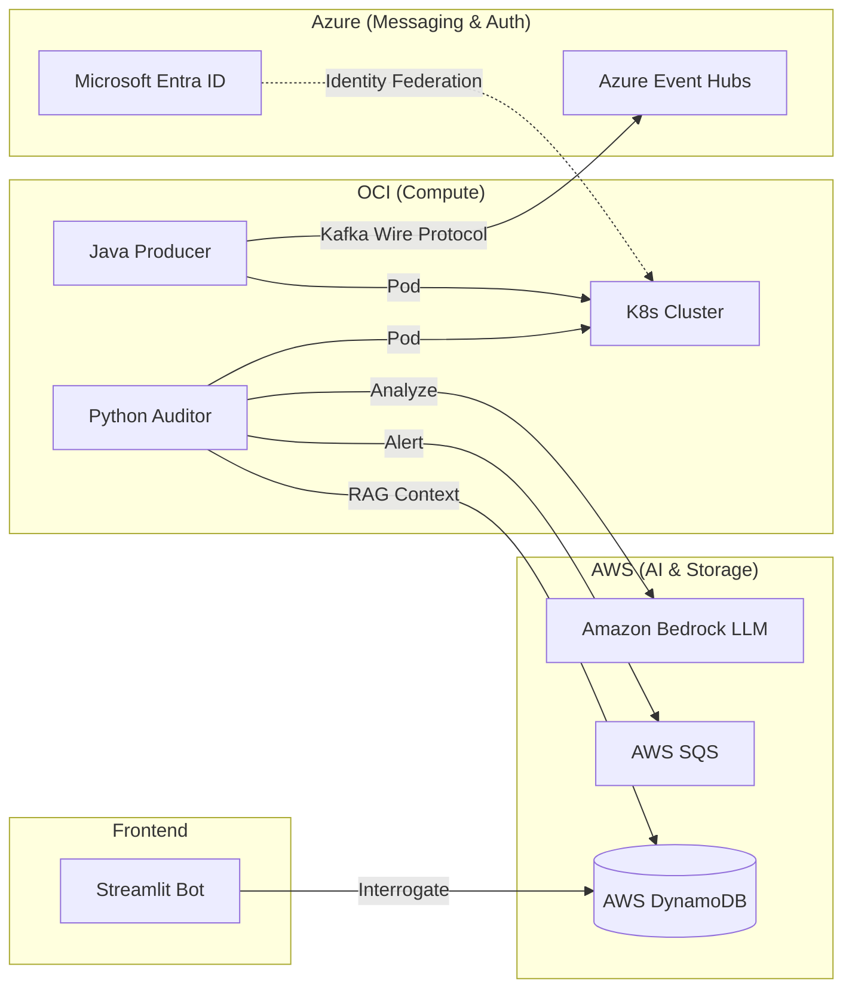

# The Polyglot Fraud Auditor 🕵️‍♂️🛡️

### **Multi-Cloud Agentic AI Ecosystem (Java + Python + Kafka)**
**Architected for Zero-Trust Security on Azure & AWS | Orchestrated on Oracle K8s**

---

## 🌟 Overview
The **Polyglot Fraud Auditor** is a sophisticated, event-driven ecosystem designed to detect and investigate financial anomalies in real-time. This project bridges the gap between high-throughput enterprise messaging (**Java 21 / Spring Boot**) and autonomous AI reasoning (**Python 3.12 / LangGraph**). 

It is a "Cloud-Agnostic" masterpiece, strategically utilizing the **Free Tiers** of three major providers to build a production-grade system without infrastructure costs.

---

## 📂 Repository layout

| README role | Module | Purpose |
| :--- | :--- | :--- |
| **Transaction Ingress (Java)** | [`services/java-transaction-producer`](services/java-transaction-producer/) | Spring Boot API: capture transactions, publish events (Kafka/Event Hubs wire protocol or SQS in dev), receive audit callbacks. |
| **Autonomous Auditing (Python)** | [`services/python-fraud-auditor`](services/python-fraud-auditor/) | Fraud evaluation, SQS/Lambda-style handlers, FastAPI for local/dev, callbacks to Java. |
| **Interactive Investigation (Streamlit)** | *planned* | Chat UI for auditors against stored reasoning / DynamoDB—add as its own service when built. |
| **Kubernetes (OKE)** | [`infrastructure/k8s/helm/java-transaction-producer`](infrastructure/k8s/helm/java-transaction-producer/) | Helm chart for the Java producer on-cluster. |
| **Local cloud simulation** | [`docker-compose.yml`](docker-compose.yml), [`local-dev/`](local-dev/) | LocalStack and init scripts for SQS-shaped local dev. |

---

## 🏗️ Architecture & Data Flow

1.  **Transaction Ingress (Java):** A Spring Boot microservice running on **Oracle OKE** captures transaction events.
2.  **Enterprise Streaming (Azure):** Events are pushed to **Azure Event Hubs** using the **Kafka Protocol**, demonstrating Azure-native messaging expertise.
3.  **Autonomous Auditing (Python):** An AI Agent (built with **LangChain/LangGraph**) consumes events. It uses **Amazon Bedrock (Claude 3.5)** to perform deep analysis against historical data.
4.  **Security Trigger (AWS):** Verified fraud alerts are dispatched to **AWS SQS** for downstream action.
5.  **Interactive Investigation (AI Chatbot):** A **Streamlit** dashboard allows human auditors to "chat" with the AI to interrogate the reasoning behind any flagged fraud.

---

## 🛠️ The Tech Stack

| Domain | Technologies | Certification Alignment |
| :--- | :--- | :--- |
| **Compute** | Oracle OKE (Kubernetes), Docker | **CKAD (Certified K8s Developer)** |
| **Messaging** | Azure Event Hubs (Kafka), AWS SQS | **Azure Developer Associate** |
| **Intelligence** | Python, LangGraph, Amazon Bedrock, RAG | **AI / Solutions Architect** |
| **Infrastructure** | Terraform, GitHub Actions, S3 + DynamoDB | **AWS Solutions Architect** |
| **Identity** | Microsoft Entra ID (Workload Identity) | **Zero-Trust Security** |

---

## 🔐 The "Architect's Flex": Cross-Cloud Identity
This project eliminates the need for hardcoded secrets. 
- **Workload Identity Federation:** The OCI K8s cluster uses an OIDC handshake with **Microsoft Entra ID**. 
- **Secretless Access:** The Java and Python apps assume **Azure Managed Identities** and **AWS IAM Roles** dynamically, demonstrating mastery of enterprise-grade security protocols.

---

## 📈 System Logic (Mermaid Flowchart)

